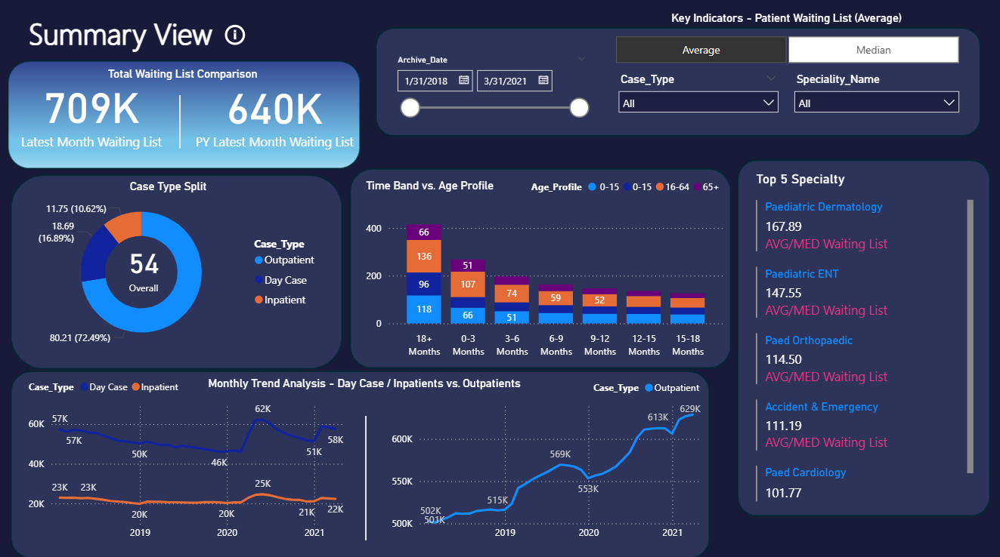
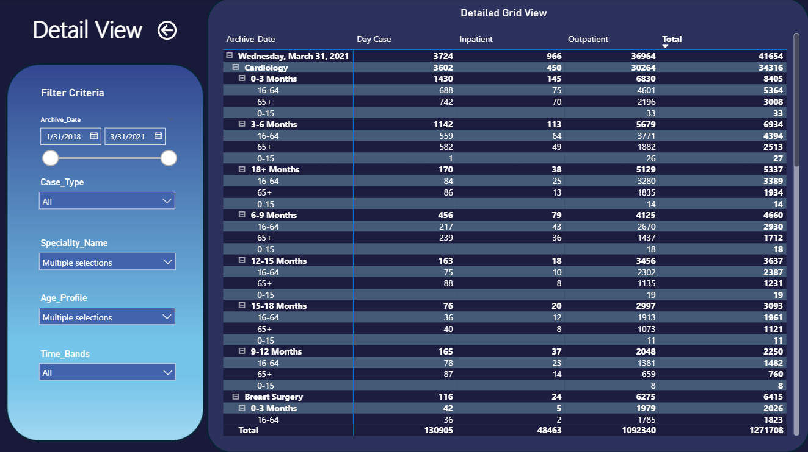

# 🏥 Power BI Patient Waiting List Dashboard

📊 **Overview**  
This Power BI dashboard analyzes patient waiting lists from 2018 to 2021.  
It provides a clear view of hospital case types, specialties, and age profiles to support data-driven healthcare decisions.

---

### 📈 **Summary View**

- **Total Waiting List Comparison** between latest and previous year  
- **Case Type Split** across Outpatient, Day Case, and Inpatient  
- **Top 5 Specialties** with average/median waiting lists  
- **Trend Analysis** for case types over time  

---

### 🧩 **Detail View**

- Drill-down by **Specialty, Age Profile, and Time Band**  
- Analyze **Inpatient, Outpatient, and Day Case** data  
- Filter by **date range, case type, and specialty**

---

### 🛠️ **Tools Used**
- **Power BI Desktop**
- **Power Query** for data cleaning and transformation
- **DAX** for calculations and KPIs

---

### 📂 **How to Use**
1. Download the `.pbix` file.
2. Open it in **Power BI Desktop**.
3. Explore filters and visuals interactively.

---

### 👩‍💻 **Author**
**Yomna Salama**  
[GitHub Profile](https://github.com/yomnaSalamaa)

---

### 📎 **Dataset**
*(Optional — add if you can share it)*  
Confidential data has been anonymized for visualization purposes.
